# Ex01 - Student Management System

## Source code structure

Read in [this file](./dirtree.txt).

## Dependencies

- Node.js v20.0.0
- npm v7.24.0
- OpenJDK 21
- Maven 3.8.4
- PostgreSQL 12.0+

## Installation

### Step 1: Clone the repository

```bash
git clone https://github.com/aarch64-softdes/Group21-Ex-001
cd Group21-Ex-001
```

### Step 2: Database Setup

#### Option 1: Using Docker (Recommended)

This option requires Docker and Docker Compose to be installed on your system.

```bash
cd backend
docker-compose up -d
```

This will start a PostgreSQL database available at: `jdbc:postgresql://localhost:5432/student-db` with username `root` and password `root`.

#### Option 2: Using an existing PostgreSQL instance

If you already have PostgreSQL installed:

1. Create a new database named `student-db`
2. Run the provided schema creation script in postgresql interface

### Step 3: Configure Backend Environment

1. Navigate to the backend directory:

   ```bash
   cd backend/src/main/resources
   ```

2. Create a new file named `application-dev.yml` using the template from `application.sample.yml`:

   ```bash
   cp application.sample.yml application-dev.yml
   ```

3. Edit `application-dev.yml` to match your database configuration:
   ```yaml
   spring:
     datasource:
       url: jdbc:postgresql://localhost:5432/student-db
       username: root
       password: root
   ```

### Step 4: Start the Backend

```bash
cd backend
mvn spring-boot:run
```

The API server should start on port 8080 (http://localhost:8080).

### Step 5: Start the Frontend

Open a new terminal window:

```bash
cd frontend
npm install
npm run dev
```

The React development server should start on port 5173 (http://localhost:5173).

### Step 6: Access the Application

Open your browser and navigate to:

- Frontend: http://localhost:5173
- Backend API: http://localhost:8080/api

## Logging Configuration

### Elasticsearch Integration

Elasticsearch integration for advanced log management. To use this feature:

1. Install Elasticsearch using the provided script:
   ```
   curl -fsSL https://elastic.co/start-local | sh
   ```
2. Configure the connection in `application-dev.yml` with your API key
3. Set `logging.controller.logger-type: ELASTICSEARCH`

The system will create date-based indices (e.g., `logs-2025-03-19`) for easy log rotation and management.

### Setting Up Kibana Data View

After Elasticsearch is running and your application has generated some logs:

1. Open Kibana at http://localhost:5601
2. Navigate to Stack Management > Data Views
3. Click "Create data view"
4. Set the name to "Application Logs"
5. Set the index pattern to `logs-*` (matching the prefix in your config)
6. Select the timestamp field (@timestamp or timestamp)
7. Click "Save data view to Kibana"

Now you can use Discover to search and filter your logs, or create visualizations and dashboards.

## Features

### Course

- Course creation:
  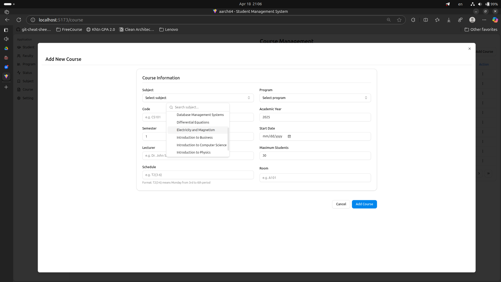
- Course update:
  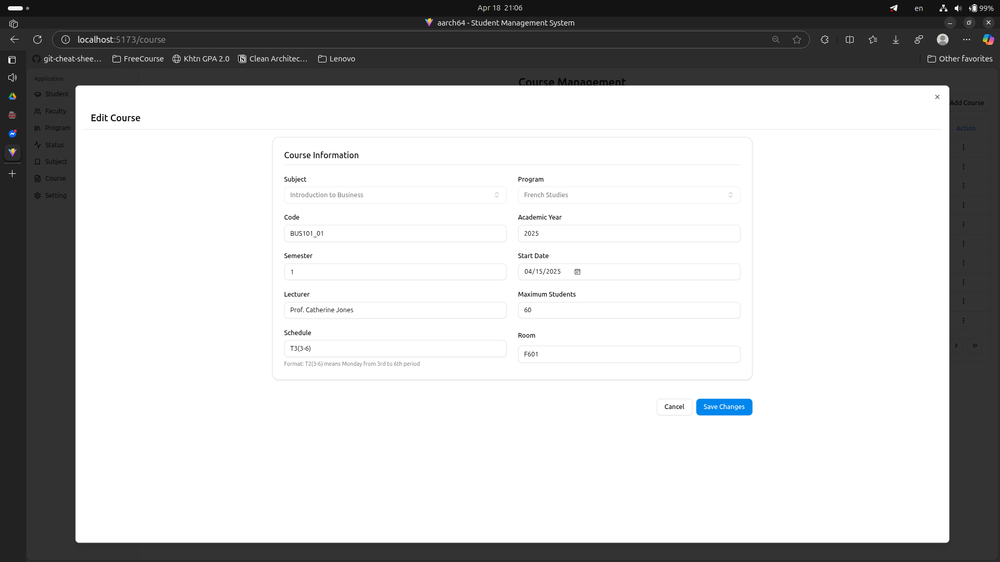
- Course list:
  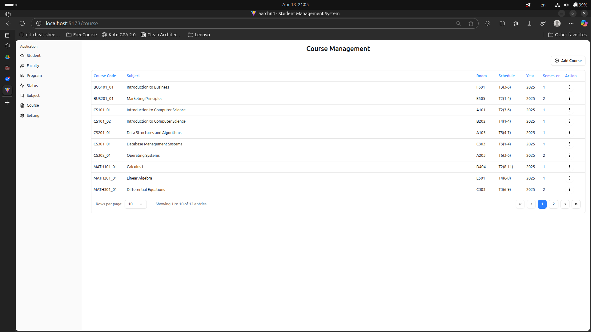
- Course detail:
  
- Course enrollment:
  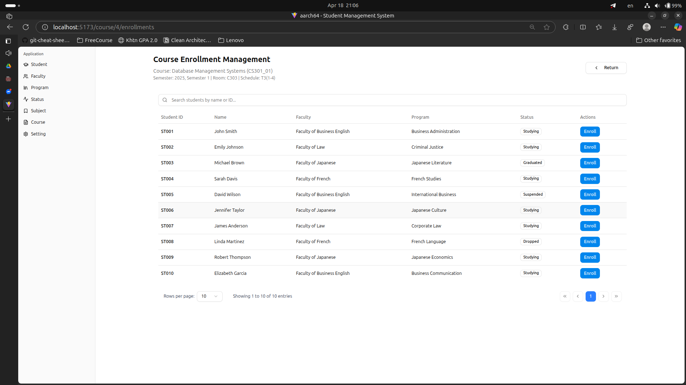
- Invalid prerequisite enrollment:
  
- Modified courses which are out of duration:
  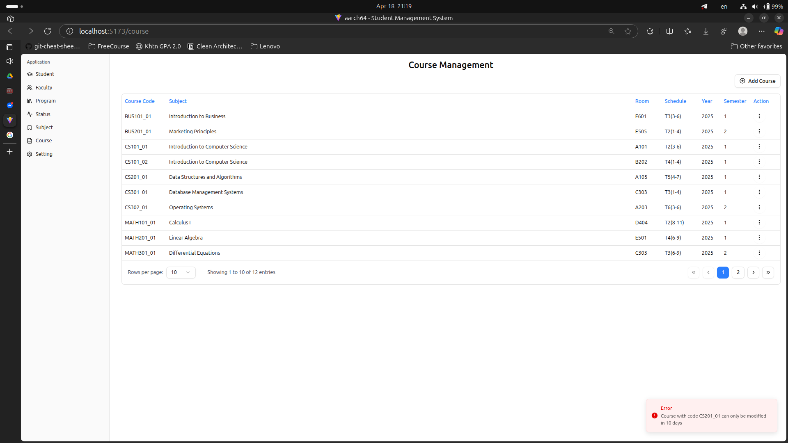

### Enrollment

- Enrollment creation:
  
- Current enrollments of students:
  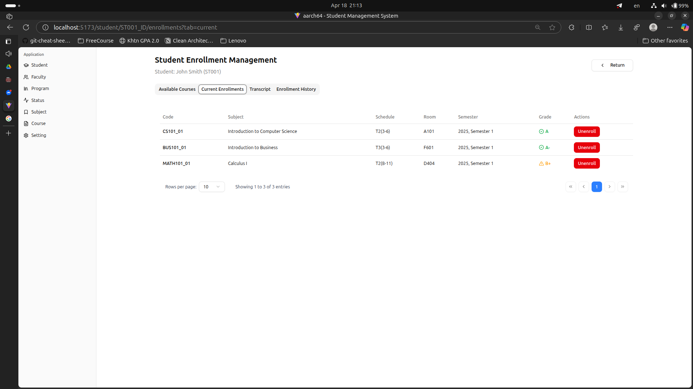
- Enrollment transcript:
  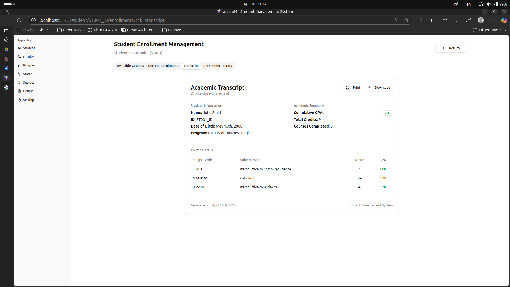
- Enrollment transcript export:
  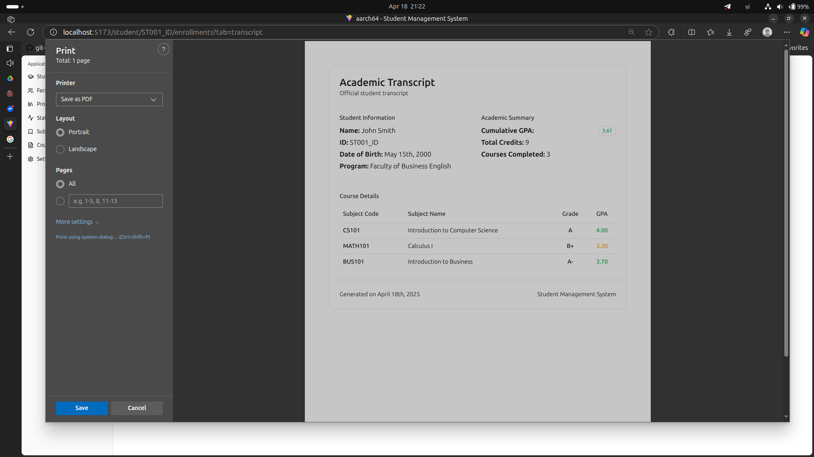
- Enrollment history:
  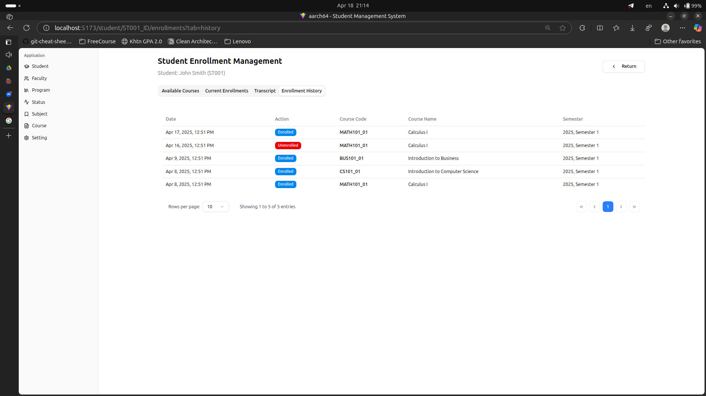

### Subject

- Subject creation:
  
- Subject update:
  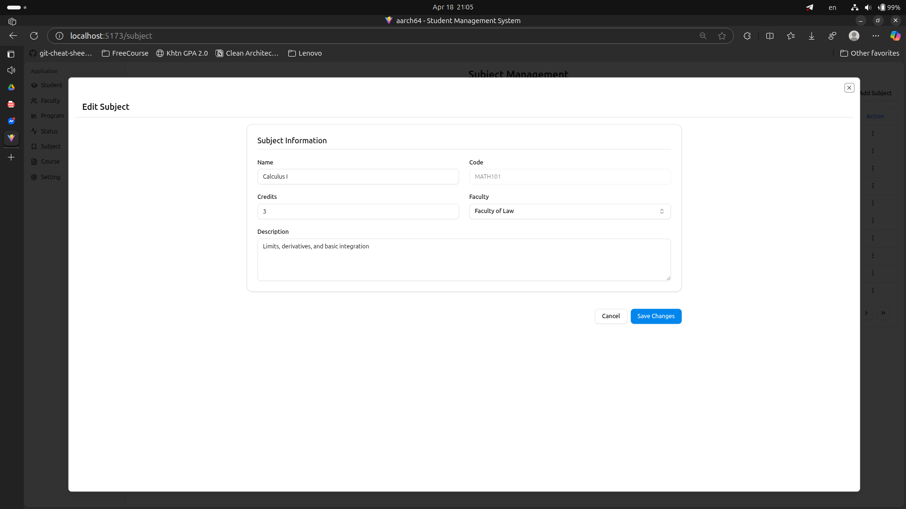
- Subject list:
  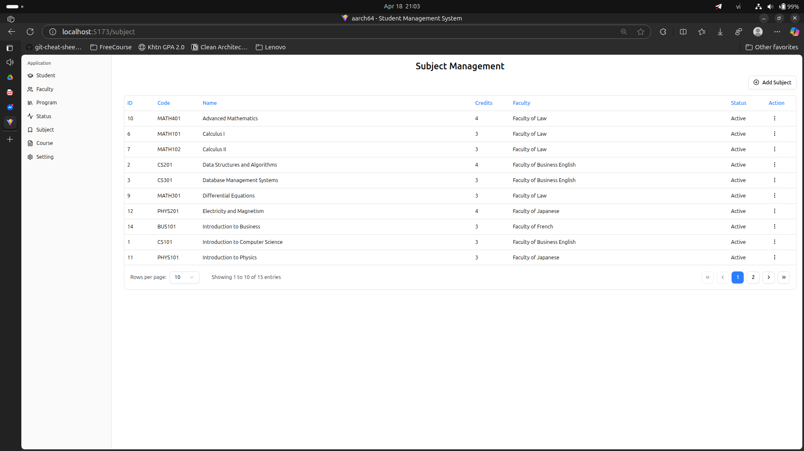
- Subject detail:
  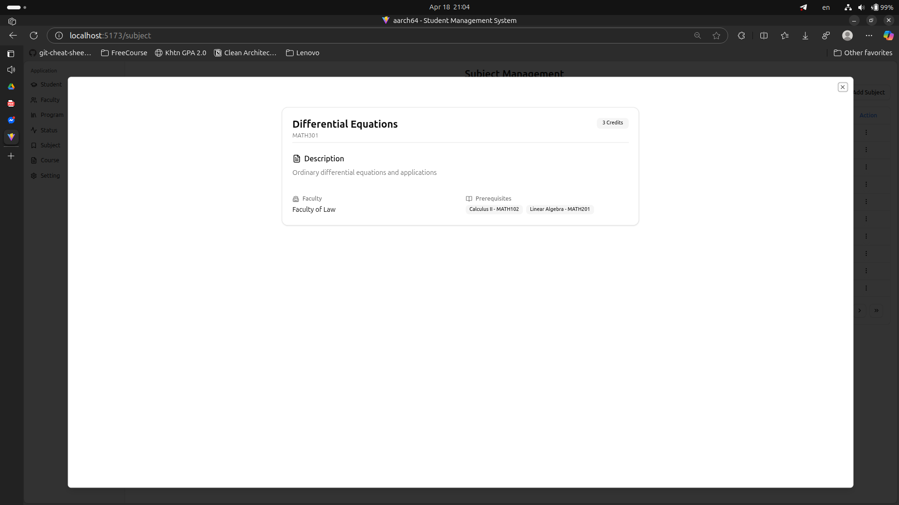
- Subject deactive:
  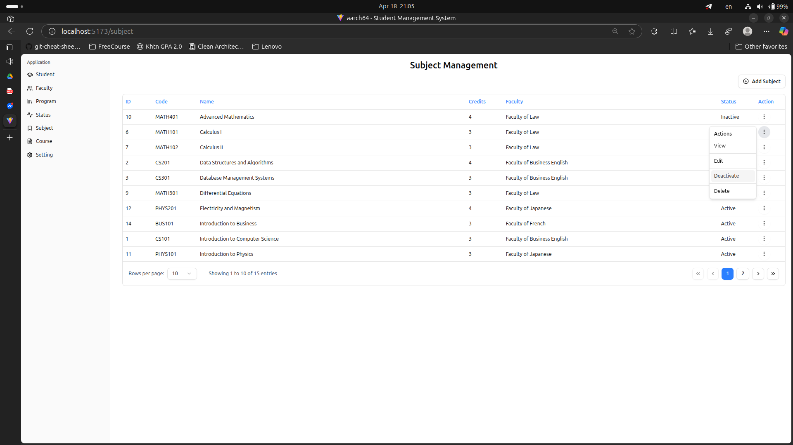

### Setting - Adjustment duration

- Setting duration:
  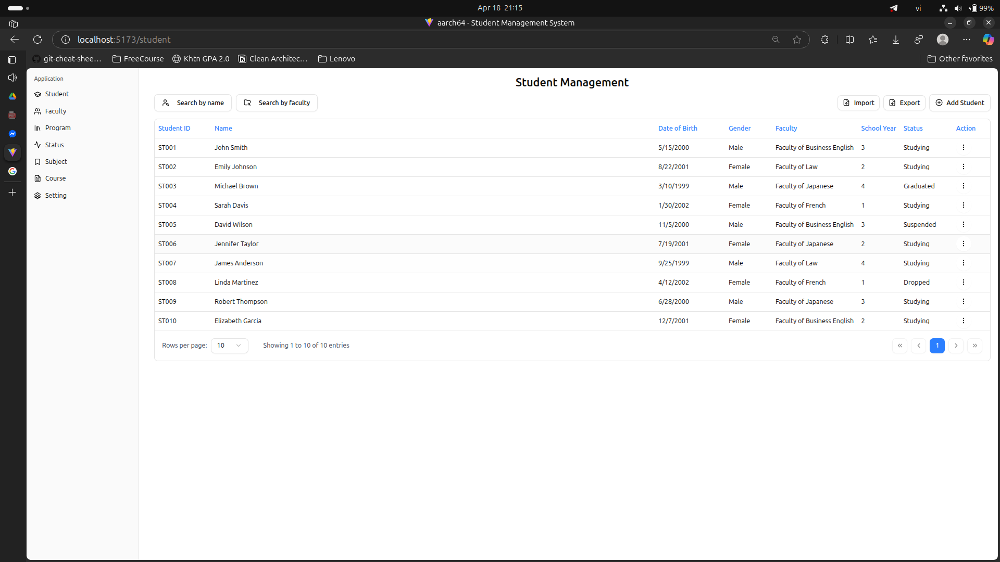
