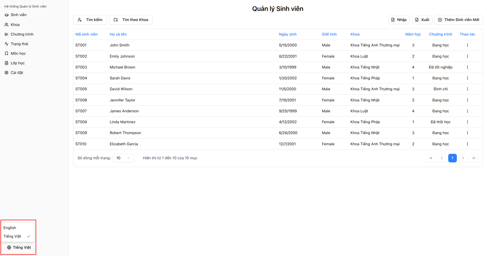
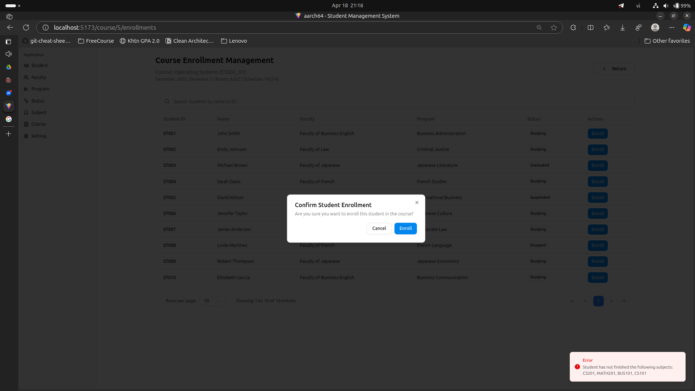

# Ex01 - Student Management System

## Source code structure

Read in [this file](./dirtree.txt).

## Developer Guide

The backend is built with Spring Boot and relies on Spring Beans for dependency injection.
Documentation for backend contributors is available under
[`documents/developer-guide`](documents/developer-guide).
Start with `ArchitectureOverview.md` for a summary of the system design and follow the other documents for specific topics such as testing or settings management.

## Dependencies

- Node.js v20.0.0
- npm v7.24.0
- OpenJDK 21
- Maven 3.8.4
- PostgreSQL 12.0+

## Installation

### Step 1: Clone the repository

```bash
git clone https://github.com/aarch64-softdes/Group21-Ex-001
cd Group21-Ex-001
```

### Step 2: Database Setup

#### Option 1: Using Docker (Recommended)

This option requires Docker and Docker Compose to be installed on your system.

```bash
cd backend
docker-compose up -d
```

This will start a PostgreSQL database available at: `jdbc:postgresql://localhost:5432/student-db` with username `root` and password `root`.

#### Option 2: Using an existing PostgreSQL instance

If you already have PostgreSQL installed:

1. Create a new database named `student-db`
2. Run the provided schema creation script in postgresql interface

### Step 3: Configure Backend Environment

1. Navigate to the backend directory:

   ```bash
   cd backend/src/main/resources
   ```

2. Create a new file named `application-dev.yml` using the template from `application.sample.yml`:

   ```bash
   cp application.sample.yml application-dev.yml
   ```

3. Edit `application-dev.yml` to match your database configuration:
   ```yaml
   spring:
     datasource:
       url: jdbc:postgresql://localhost:5432/student-db
       username: root
       password: root
   ```

### Step 4: Start the Backend

```bash
cd backend
mvn spring-boot:run
```

> [!WARNING]
> If you encouter an error related to `Mojo...`, go to `backend/pom.xml` and change the version of `lombok` to `1.18.38` or higher.

The API server should start on port 8080 (http://localhost:8080).

### Step 5: Start the Frontend

Open a new terminal window:

```bash
cd frontend
npm install
npm run dev
```

The React development server should start on port 5173 (http://localhost:5173).

### Step 6: Access the Application

Open your browser and navigate to:

- Frontend: http://localhost:5173
- Backend API: http://localhost:8080/api

## Logging Configuration

### Elasticsearch Integration

Elasticsearch integration for advanced log management. To use this feature:

1. Install Elasticsearch using the provided script:
   ```
   curl -fsSL https://elastic.co/start-local | sh
   ```
2. Configure the connection in `application-dev.yml` with your API key
3. Set `logging.controller.logger-type: ELASTICSEARCH`

The system will create date-based indices (e.g., `logs-2025-03-19`) for easy log rotation and management.

### Setting Up Kibana Data View

After Elasticsearch is running and your application has generated some logs:

1. Open Kibana at http://localhost:5601
2. Navigate to Stack Management > Data Views
3. Click "Create data view"
4. Set the name to "Application Logs"
5. Set the index pattern to `logs-*` (matching the prefix in your config)
6. Select the timestamp field (@timestamp or timestamp)
7. Click "Save data view to Kibana"

Now you can use Discover to search and filter your logs, or create visualizations and dashboards.

## Screenshots

### Multilingual Supported

- User can change the language of the application in the bottom left of the page.
  

> [!IMPORTANT]
>
> 1. The system currently supports dynamic content translation. If the content of the selected language is not available, it will default to English.
> 2. To add the content for a specific language, currently user need to choose the language in the application. The newly added content will be saved with the selected language. For example, if the user selects Vietnamese, the content will be saved in Vietnamese. If the user selects English, the content will be saved in English. The system will **NOT** automatically translate the content.

### Course

- Course creation:
  
- Course update:
  
- Course list:
  
- Course detail:
  
- Course enrollment:
  
- Invalid prerequisite enrollment:
  
- Modified courses which are out of duration:
  

### Enrollment

- Enrollment creation:
  
- Current enrollments of students:
  
- Enrollment transcript:
  
- Enrollment transcript export:
  
- Enrollment enrollmentHistory:
  

### Subject

- Subject creation:
  
- Subject update:
  
- Subject list:
  
- Subject detail:
  
- Subject deactive:
  

### Setting - Adjustment duration

- Setting duration:
  
