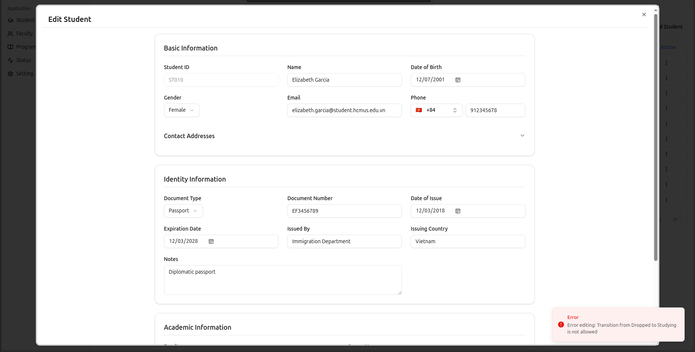

# Ex01 - Student Management System

## Source code structure

```
.
├── backend
│   ├── mvnw
│   ├── mvnw.cmd
│   ├── pom.xml
│   ├── src
│   │   ├── main
│   │   │   ├── java
│   │   │   │   └── com
│   │   │   │       └── tkpm
│   │   │   │           └── sms
│   │   │   │               ├── aspect
│   │   │   │               │   └── ControllerLoggingAspect.java
│   │   │   │               ├── config
│   │   │   │               │   ├── ElasticsearchConfig.java
│   │   │   │               │   └── FileMapperConfig.java
│   │   │   │               ├── controller
│   │   │   │               │   ├── FacultyController.java
│   │   │   │               │   ├── FileController.java
│   │   │   │               │   ├── MetadataController.java
│   │   │   │               │   ├── ProgramController.java
│   │   │   │               │   ├── SettingController.java
│   │   │   │               │   ├── StatusController.java
│   │   │   │               │   └── StudentController.java
│   │   │   │               ├── dto
│   │   │   │               │   ├── request
│   │   │   │               │   │   ├── address
│   │   │   │               │   │   │   ├── AddressCreateRequestDto.java
│   │   │   │               │   │   │   └── AddressUpdateRequestDto.java
│   │   │   │               │   │   ├── common
│   │   │   │               │   │   │   └── BaseCollectionRequest.java
│   │   │   │               │   │   ├── faculty
│   │   │   │               │   │   │   └── FacultyRequestDto.java
│   │   │   │               │   │   ├── identity
│   │   │   │               │   │   │   ├── IdentityCreateRequestDto.java
│   │   │   │               │   │   │   └── IdentityUpdateRequestDto.java
│   │   │   │               │   │   ├── phone
│   │   │   │               │   │   │   └── PhoneRequestDto.java
│   │   │   │               │   │   ├── program
│   │   │   │               │   │   │   └── ProgramRequestDto.java
│   │   │   │               │   │   ├── setting
│   │   │   │               │   │   │   ├── EmailDomainSettingRequestDto.java
│   │   │   │               │   │   │   └── PhoneSettingRequestDto.java
│   │   │   │               │   │   ├── status
│   │   │   │               │   │   │   ├── AllowedTransitionDto.java
│   │   │   │               │   │   │   ├── StatusRequestDto.java
│   │   │   │               │   │   │   └── StatusVerificationDto.java
│   │   │   │               │   │   └── student
│   │   │   │               │   │       ├── StudentCollectionRequest.java
│   │   │   │               │   │       ├── StudentCreateRequestDto.java
│   │   │   │               │   │       └── StudentUpdateRequestDto.java
│   │   │   │               │   └── response
│   │   │   │               │       ├── common
│   │   │   │               │       │   ├── ApplicationResponseDto.java
│   │   │   │               │       │   ├── ListResponse.java
│   │   │   │               │       │   └── PageDto.java
│   │   │   │               │       ├── FacultyDto.java
│   │   │   │               │       ├── identity
│   │   │   │               │       │   └── IdentityDto.java
│   │   │   │               │       ├── PhoneDto.java
│   │   │   │               │       ├── ProgramDto.java
│   │   │   │               │       ├── setting
│   │   │   │               │       │   ├── EmailDomainSettingDto.java
│   │   │   │               │       │   ├── PhoneSettingDto.java
│   │   │   │               │       │   └── SettingDto.java
│   │   │   │               │       ├── StatusDto.java
│   │   │   │               │       └── student
│   │   │   │               │           ├── StudentDto.java
│   │   │   │               │           ├── StudentFileDto.java
│   │   │   │               │           └── StudentMinimalDto.java
│   │   │   │               ├── entity
│   │   │   │               │   ├── Address.java
│   │   │   │               │   ├── Faculty.java
│   │   │   │               │   ├── Identity.java
│   │   │   │               │   ├── Program.java
│   │   │   │               │   ├── Setting.java
│   │   │   │               │   ├── Status.java
│   │   │   │               │   └── Student.java
│   │   │   │               ├── enums
│   │   │   │               │   ├── Faculty.java
│   │   │   │               │   ├── Gender.java
│   │   │   │               │   ├── IdentityType.java
│   │   │   │               │   ├── LoggerType.java
│   │   │   │               │   ├── Status.java
│   │   │   │               │   └── SupportedFileType.java
│   │   │   │               ├── exceptions
│   │   │   │               │   ├── ApplicationException.java
│   │   │   │               │   ├── ErrorCode.java
│   │   │   │               │   └── GlobalExceptionHandler.java
│   │   │   │               ├── factories
│   │   │   │               │   └── FileStrategyFactory.java
│   │   │   │               ├── logging
│   │   │   │               │   ├── BaseLogger.java
│   │   │   │               │   ├── LogEntry.java
│   │   │   │               │   ├── logger
│   │   │   │               │   │   ├── AbstractLogger.java
│   │   │   │               │   │   ├── ConsoleLogger.java
│   │   │   │               │   │   ├── ElasticsearchLogger.java
│   │   │   │               │   │   ├── FileLogger.java
│   │   │   │               │   │   └── JsonLogger.java
│   │   │   │               │   ├── LoggerManager.java
│   │   │   │               │   └── metadata
│   │   │   │               │       ├── BaseMetadata.java
│   │   │   │               │       ├── ExceptionMetadata.java
│   │   │   │               │       ├── RequestMetadata.java
│   │   │   │               │       └── ResponseMetadata.java
│   │   │   │               ├── mapper
│   │   │   │               │   ├── AddressMapper.java
│   │   │   │               │   ├── FacultyMapper.java
│   │   │   │               │   ├── IdentityMapper.java
│   │   │   │               │   ├── ProgramMapper.java
│   │   │   │               │   ├── StatusMapper.java
│   │   │   │               │   └── StudentMapper.java
│   │   │   │               ├── repository
│   │   │   │               │   ├── AddressRepository.java
│   │   │   │               │   ├── FacultyRepository.java
│   │   │   │               │   ├── IdentityRepository.java
│   │   │   │               │   ├── ProgramRepository.java
│   │   │   │               │   ├── SettingRepository.java
│   │   │   │               │   ├── StatusRepository.java
│   │   │   │               │   └── StudentRepository.java
│   │   │   │               ├── service
│   │   │   │               │   ├── AddressService.java
│   │   │   │               │   ├── FacultyService.java
│   │   │   │               │   ├── FileService.java
│   │   │   │               │   ├── IdentityService.java
│   │   │   │               │   ├── ProgramService.java
│   │   │   │               │   ├── SettingService.java
│   │   │   │               │   ├── StatusService.java
│   │   │   │               │   └── StudentService.java
│   │   │   │               ├── SmsApplication.java
│   │   │   │               ├── specification
│   │   │   │               │   └── StudentSpecifications.java
│   │   │   │               ├── strategies
│   │   │   │               │   ├── CsvStrategy.java
│   │   │   │               │   ├── FileStrategy.java
│   │   │   │               │   └── JsonStrategy.java
│   │   │   │               ├── utils
│   │   │   │               │   ├── EnumUtils.java
│   │   │   │               │   ├── ImportFileUtils.java
│   │   │   │               │   ├── JsonUtils.java
│   │   │   │               │   └── PhoneUtils.java
│   │   │   │               └── validator
│   │   │   │                   ├── identity
│   │   │   │                   │   ├── IdentityConstraint.java
│   │   │   │                   │   └── IdentityValidator.java
│   │   │   │                   ├── required
│   │   │   │                   │   ├── RequiredConstraint.java
│   │   │   │                   │   └── RequiredValidator.java
│   │   │   │                   └── status
│   │   │   │                       ├── StatusConstraint.java
│   │   │   │                       └── StatusValidator.java
│   │   │   └── resources
│   │   │       ├── application.sample.yml
│   │   │       ├── application.yml
│   │   │       ├── db
│   │   │       │   └── migration
│   │   │       │       └── initial-schema.sql
│   │   │       └── logback.xml
│   │   └── test
│   │       └── java
│   │           └── com
│   │               └── tkpm
│   │                   └── sms
│   │                       └── SmsApplicationTests.java
├── database_creation.sql
├── documents
│   └── assets
│       ├── add-student-existed-id.png
│       ├── edit-student-existed-id.png
│       ├── emaildomain-validation.png
│       ├── phonenumer-validation.png
│       ├── setting-phonenumber-emaildomain.png
│       ├── status-transistion-edit.png
│       ├── status-transition-setting.png
│       └── Week02
│           ├── SD-export-1.png
│           ├── SD-export-csv.png
│           ├── SD-export-json.png
│           ├── SD-faculty-add.png
│           ├── SD-faculty-edit.png
│           ├── SD-import-csv-1.png
│           ├── SD-import-csv-2.png
│           ├── SD-import-csv-3.png
│           ├── SD-import-csv-4.png
│           ├── SD-import-json-1.png
│           ├── SD-import-json-2.png
│           ├── SD-import-json-3.png
│           ├── SD-logging-elastic-search.png
│           ├── SD-logging-json.png
│           ├── SD-program-add.png
│           ├── SD-program-update.png
│           ├── SD-search-name-faculty.png
│           ├── SD-search-name.png
│           ├── SD-status-add.png
│           ├── SD-status-update.png
│           ├── SD-update-student-1.png
│           └── SD-update-student-2.png
├── frontend
│   ├── components.json
│   ├── eslint.config.js
│   ├── index.html
│   ├── package.json
│   ├── package-lock.json
│   ├── public
│   │   └── vite.svg
│   ├── README.md
│   ├── src
│   │   ├── App.tsx
│   │   ├── assets
│   │   │   └── react.svg
│   │   ├── components
│   │   │   ├── error
│   │   │   │   ├── ErrorBoundary.tsx
│   │   │   │   └── ErrorPage.tsx
│   │   │   ├── faculty
│   │   │   │   ├── FacultyDetail.tsx
│   │   │   │   └── FacultyForm.tsx
│   │   │   ├── filter
│   │   │   │   └── SearchFilter.tsx
│   │   │   ├── layouts
│   │   │   │   ├── AppSidebar.tsx
│   │   │   │   └── Layout.tsx
│   │   │   ├── program
│   │   │   │   ├── ProgramDetail.tsx
│   │   │   │   └── ProgramForm.tsx
│   │   │   ├── settings
│   │   │   │   ├── EmailDomainSettings.tsx
│   │   │   │   └── PhoneSettings.tsx
│   │   │   ├── status
│   │   │   │   ├── StatusDetail.tsx
│   │   │   │   └── StatusForm.tsx
│   │   │   ├── student
│   │   │   │   ├── AddressForm.tsx
│   │   │   │   ├── PhoneField.tsx
│   │   │   │   ├── StudentDetail.tsx
│   │   │   │   └── StudentForm.tsx
│   │   │   ├── table
│   │   │   │   ├── ActionCell.tsx
│   │   │   │   ├── FileExportButton.tsx
│   │   │   │   ├── FileImportButton.tsx
│   │   │   │   ├── GenericTable.tsx
│   │   │   │   ├── SkeletonTable.tsx
│   │   │   │   ├── TablePagination.tsx
│   │   │   │   └── TableSort.tsx
│   │   │   └── ui
│   │   │       ├── accordion.tsx
│   │   │       ├── alert-dialog.tsx
│   │   │       ├── avatar.tsx
│   │   │       ├── badge.tsx
│   │   │       ├── button.tsx
│   │   │       ├── card.tsx
│   │   │       ├── checkbox.tsx
│   │   │       ├── command.tsx
│   │   │       ├── dialog.tsx
│   │   │       ├── dropdown-menu.tsx
│   │   │       ├── form.tsx
│   │   │       ├── input.tsx
│   │   │       ├── label.tsx
│   │   │       ├── loadingButton.tsx
│   │   │       ├── popover.tsx
│   │   │       ├── scroll-area.tsx
│   │   │       ├── select.tsx
│   │   │       ├── separator.tsx
│   │   │       ├── sheet.tsx
│   │   │       ├── sidebar.tsx
│   │   │       ├── skeleton.tsx
│   │   │       ├── sonner.tsx
│   │   │       ├── table.tsx
│   │   │       └── tooltip.tsx
│   │   ├── data
│   │   │   └── countryData.ts
│   │   ├── hooks
│   │   │   ├── api
│   │   │   │   ├── useFacultyApi.ts
│   │   │   │   ├── useMetadata.ts
│   │   │   │   ├── useProgramApi.ts
│   │   │   │   ├── useSettingsApi.ts
│   │   │   │   ├── useStatusApi.ts
│   │   │   │   └── useStudentApi.ts
│   │   │   ├── useDebounce.ts
│   │   │   ├── use-mobile.ts
│   │   │   └── useTableDataOperation.ts
│   │   ├── index.css
│   │   ├── lib
│   │   │   ├── api.ts
│   │   │   ├── errors.ts
│   │   │   ├── toast-utils.ts
│   │   │   └── utils.ts
│   │   ├── main.tsx
│   │   ├── pages
│   │   │   ├── facultyPage.tsx
│   │   │   ├── programPage.tsx
│   │   │   ├── settingPage.tsx
│   │   │   ├── statusPage.tsx
│   │   │   └── studentPage.tsx
│   │   ├── services
│   │   │   ├── facultyService.ts
│   │   │   ├── metadataService.ts
│   │   │   ├── programService.ts
│   │   │   ├── settingService.ts
│   │   │   ├── statusService.ts
│   │   │   └── studentService.ts
│   │   ├── types
│   │   │   ├── address.ts
│   │   │   ├── apiResponse.ts
│   │   │   ├── faculty.ts
│   │   │   ├── filter.ts
│   │   │   ├── identityDocument.ts
│   │   │   ├── program.ts
│   │   │   ├── setting.ts
│   │   │   ├── status.ts
│   │   │   ├── student.ts
│   │   │   └── table.ts
│   │   └── vite-env.d.ts
│   ├── tailwind.config.js
│   ├── tsconfig.app.json
│   ├── tsconfig.json
│   ├── tsconfig.node.json
│   └── vite.config.ts
├── import-student-csv.csv
├── import-student-json.json
├── README.md
└── tree.txt

136 directories, 411 files
```

## Dependencies

- Node.js v20.0.0
- npm v7.24.0
- OpenJDK 21
- Maven 3.8.4
- PostgreSQL 12.0+

## Installation

### Step 1: Clone the repository

```bash
git clone https://github.com/aarch64-softdes/Group21-Ex-001
cd Group21-Ex-001
```

### Step 2: Database Setup

#### Option 1: Using Docker (Recommended)

This option requires Docker and Docker Compose to be installed on your system.

```bash
cd backend
docker-compose up -d
```

This will start a PostgreSQL database available at: `jdbc:postgresql://localhost:5432/student-db` with username `root` and password `root`.

#### Option 2: Using an existing PostgreSQL instance

If you already have PostgreSQL installed:

1. Create a new database named `student-db`
2. Run the provided schema creation script in postgresql interface

### Step 3: Configure Backend Environment

1. Navigate to the backend directory:

   ```bash
   cd backend/src/main/resources
   ```

2. Create a new file named `application-dev.yml` using the template from `application.sample.yml`:

   ```bash
   cp application.sample.yml application-dev.yml
   ```

3. Edit `application-dev.yml` to match your database configuration:
   ```yaml
   spring:
     datasource:
       url: jdbc:postgresql://localhost:5432/student-db
       username: root
       password: root
   ```

### Step 4: Start the Backend

```bash
cd backend
mvn spring-boot:run
```

The API server should start on port 8080 (http://localhost:8080).

### Step 5: Start the Frontend

Open a new terminal window:

```bash
cd frontend
npm install
npm run dev
```

The React development server should start on port 5173 (http://localhost:5173).

### Step 6: Access the Application

Open your browser and navigate to:

- Frontend: http://localhost:5173
- Backend API: http://localhost:8080/api

## Logging Configuration

### Elasticsearch Integration

Elasticsearch integration for advanced log management. To use this feature:

1. Install Elasticsearch using the provided script:
   ```
   curl -fsSL https://elastic.co/start-local | sh
   ```
2. Configure the connection in `application-dev.yml` with your API key
3. Set `logging.controller.logger-type: ELASTICSEARCH`

The system will create date-based indices (e.g., `logs-2025-03-19`) for easy log rotation and management.

### Setting Up Kibana Data View

After Elasticsearch is running and your application has generated some logs:

1. Open Kibana at http://localhost:5601
2. Navigate to Stack Management > Data Views
3. Click "Create data view"
4. Set the name to "Application Logs"
5. Set the index pattern to `logs-*` (matching the prefix in your config)
6. Select the timestamp field (@timestamp or timestamp)
7. Click "Save data view to Kibana"

Now you can use Discover to search and filter your logs, or create visualizations and dashboards.

## Feature Demonstrations

### Configurable Phone number and Email domain

#### 1. Phone number


#### 2. Emai domain


### Status transition

Status transition configuration:


Status transition during edit:


### Forbid add/update student with existed student's id

Adding student with existing ID:


Editing student with existing ID:

