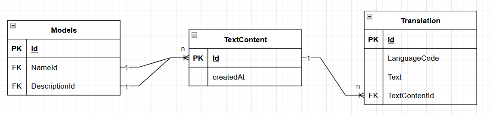

# MULTI-LANGUAGE SUPPORTED:

### Static text:
* Internationalization (i18n) is implemented using the `org.springframework.context.MessageSource` class.
* The `messages.properties` file is used to store the default language (English) messages.
* The `messages_vi.properties` file is used to store the Vietnamese messages.
* Create a `MessageSourceConfig` class to configure the `MessageSource` bean, which will  load message properties files (e.g., .properties) for internationalization purposes.
* To i18n error messages:
  * Replace hard-coded error messages in the code with keys from the properties files (e.g., `message = "{error.resource.not_found}"`).
  * In controller advice, use `MessageSource` to get the error message based on the key and the current locale.
  * Use `LocaleContextHolder` to get the current locale and pass it to the `MessageSource` along with arguments to retriseve the appropriate message.
* Example:
  ```java
  // In properties file
  // messages.properties
  error.resource.not_found=Resource not found

  // messages_vi.properties
  error.resource.not_found=Tài nguyên không tìm thấy
  
  // In controller advice
  class CustomExceptionHandler {
      @Autowired
      private MessageSource messageSource;

      @ExceptionHandler(ResourceNotFoundException.class)
      public ResponseEntity<ErrorResponse> handleResourceNotFoundException(ResourceNotFoundException ex) {
          String errorMessage = messageSource.getMessage("error.resource.not_found", null, LocaleContextHolder.getLocale());
          ErrorResponse errorResponse = new ErrorResponse(errorMessage);
          return ResponseEntity.status(HttpStatus.NOT_FOUND).body(errorResponse);
      }
  }

  // Request
  GET /api/courses/999
  Content-Language: vi

  // Response 
  {
      "error": {
          "message": "Tài nguyên không tìm thấy"
      }
  }
  ```
### Dynamic text:
* Configure `LocaleConfig` for getting `LanguageCode` in header of requests (ex. content-language: vi).
* Use value objects `TextContent` and `Translation` for saving and retrieving language base on `LanguageCode`(ex. en, vi, fr, ...).
* Use `TextContent` instead of `String` for name and description of some models: `Subject`, `Status`, `Program`, `Faculty`.
* Relationships between `TextContent`, `Translation` and `Models` are as follows:
  * `TextContent` has many `Translation`
  * `Translation` belongs to `TextContent`
  * `TextContent` belongs to `Subject`, `Status`, `Program`, `Faculty`
  * `Subject`, `Status`, `Program`, `Faculty` has many `TextContent`
  

* With error message, we define a template for message and use `org.springframework.context.MessageSource` class to get the message in the target language.
* Fallback strategy: Always return default language if translation is missing to improve UX.

### Drawback:
* Must join `TextContent` and `Translation` table whenever we want to get name and description of `Subject`, `Status`, `Program`, `Faculty`.
* Overhead in Testing and Seeding.