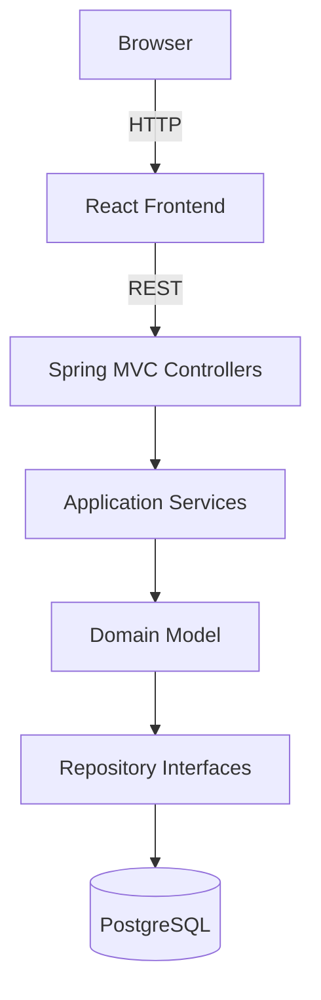
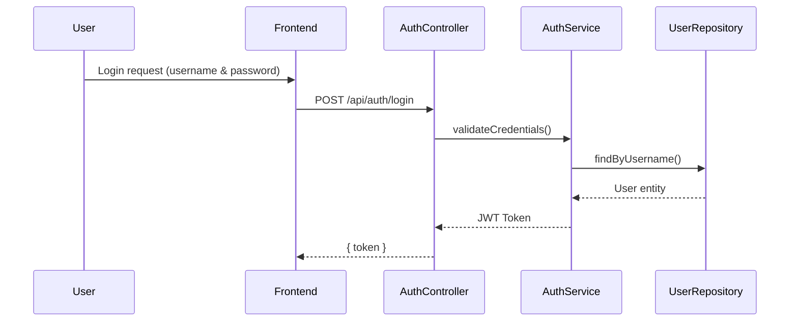
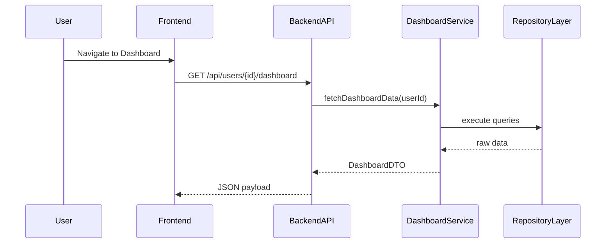
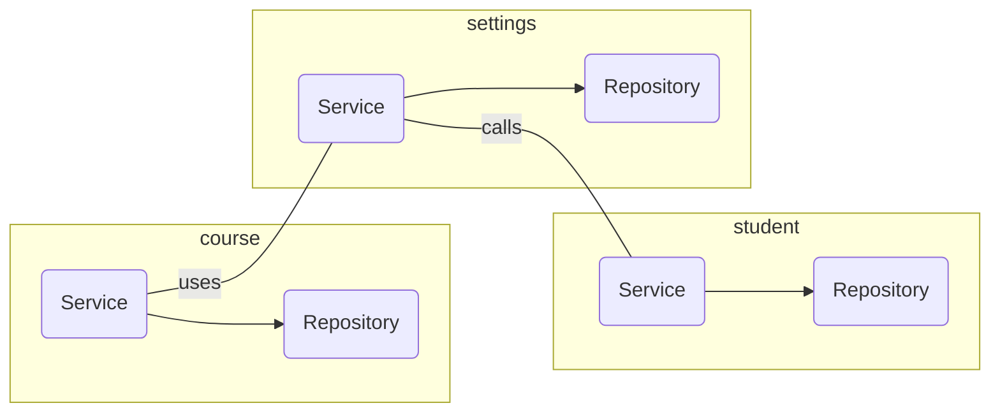
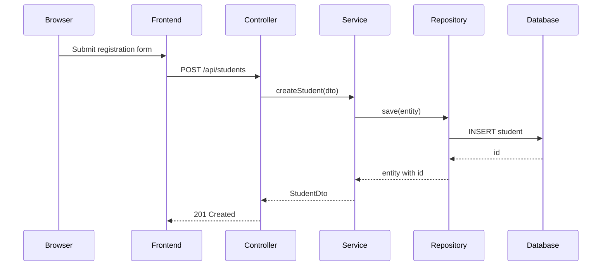

# Architecture Overview

* This project follows the principles of **Clean Architecture** with distinct layers separating framework concerns from domain logic. 
* The goal is to ensure that business rules remain independent of the surrounding infrastructure while still leveraging Spring Boot and React for rapid development.
* Dependency injection in the backend is provided by Spring's Bean container. Services and repositories are registered as beans and injected via constructors.

## 1. System Components

### 1.1 Frontend (React + TypeScript)
- Built with Vite and React to provide a fast, interactive UI.
- Organized by feature modules under `src/features`, co-locating components, styles, and tests.
- Communicates with backend services via REST APIs.

### 1.2 Backend (Spring Boot + Java)
- Monolithic Spring Boot application exposing RESTful endpoints under `/api`.
- Layered into `controller`, `service`, `repository`, `domain`, and `dto` packages.
- Handles authentication, business logic, and data validation.

### 1.3 Persistence (Relational Database)
- Uses a PostgreSQL (or configurable) database for core data storage.
- Schema defined in `database_creation.sql` and managed via Flyway or Liquibase migrations.
- Entities mapped with JPA/Hibernate.

### 1.4 Logging & Search
- Application logs output in JSON format to standard streams.
- Elastic Stack (Elasticsearch + Kibana) for centralized log aggregation and search, configured via Docker Compose.

### 1.5 CI/CD (Jenkins)
- Jenkins pipeline defined in `Jenkinsfile` automates build, test, and deployment steps.
- Builds Docker images for backend and deploys to staging/production environments.

## 2. Development & Deployment Flow

### 2.1 Local Development
- Run `docker-compose.yml` in `/backend` to spin up PostgreSQL and Elasticsearch services.
- Launch backend via `./mvnw spring-boot:run` and frontend via `npm run dev`.
- Hot reload enabled for rapid feedback.

### 2.2 Production Deployment
- Backend and frontend applications are packaged into Docker images.
- Images pushed to container registry and deployed via orchestration platform (e.g., Kubernetes).
- Environment-specific configurations loaded from external `application.yml` profiles.

## 3. Layer Responsibilities

### 3.1 Presentation
- Package `com.tkpm.sms.presentation`.
- Exposes REST endpoints under `/api` using Spring MVC.
- Handles global exception translation to JSON responses.
- Interceptors such as `ContentLanguageInterceptor` set the locale per request.
- Endpoints are currently open with no authentication or authorization.

### 3.2 Application
- Package `com.tkpm.sms.application`.
- Coordinates use cases by orchestrating domain services and repositories.
- Maps request DTOs to domain objects using MapStruct mappers.
- Executes use cases within transactional boundaries.
- Contains validators and transaction boundaries.

### 3.3 Domain
- Package `com.tkpm.sms.domain`.
- Contains the core entities (e.g., `Student`, `Course`) and value objects.
- Defines repository interfaces and domain services containing business rules.
- Domain objects are persistence-agnostic and do not depend on Spring.

### 3.4 Infrastructure
- Package `com.tkpm.sms.infrastructure`.
- Provides configuration, persistence adapters, logging and interceptors.
- Repository implementations use Spring Data JPA to interact with PostgreSQL.
- Additional modules handle caching, message translation and integration with Elasticsearch.

### 3.5 Frontend
- The React application under `frontend/` communicates with the backend using the REST API.
- React components handle form validation, routing and internationalization using i18n files.

## Detailed Data Flow

### 3.1 User Authentication Flow

### 3.2 Data Retrieval Flow

## 5. Cross-Cutting Concerns
- **Logging** – Slf4j with optional Elasticsearch integration. Logback appenders write JSON files under `backend/logs` which can be shipped to the ELK stack.
- **Localization** – `TranslatorService` resolves messages from i18n resource bundles. The `ContentLanguageInterceptor` reads the `Content-Language` header and stores the locale in a `ThreadLocal` for the duration of the request.
- **Error Handling** – A global `@ControllerAdvice` converts exceptions to `ApplicationResponseDto` objects for consistent JSON responses.

- **Caching** – Frequently used lookups such as faculties or programs are cached with Spring's `@Cacheable` abstraction backed by Caffeine. Cache keys include the current locale when the data contains translations.
## 6. Build and Testing
- Maven builds the backend; Node and Vite build the frontend.
- Unit tests reside under `backend/src/test/java` and use JUnit 5.
- Frontend tests can be added with Jest.

This layered approach keeps the domain model isolated and allows the system to evolve without coupling business rules to specific technologies.

## Deployment Environments
Each layer can be deployed separately if required. The backend produces a runnable Spring Boot JAR while the frontend compiles to static assets served by a web server or CDN. CI pipelines run linting and tests before packaging artifacts.

## Modularization Strategy
Submodules within `backend/` break down features such as student management, enrollment, and notifications. Shared contracts and utilities reside in `backend/common`. This modular approach keeps features isolated and easy to maintain.

### Core Modules
The main modules included with the system are:

- **student** – CRUD operations and validation rules for student records
- **course** – subject catalog, scheduling and enrolment management
- **settings** – runtime configuration loaded from the database
- **translations** – i18n resource loading and language management

Each module exposes its own services and controllers while depending only on domain interfaces. Infrastructure components like JPA repositories live in a parallel package under the same module name.

## Example Request Flow

These additional diagrams and explanations should make the high-level design easier to understand.

## Configuration and Environment Separation
Spring profiles allow different configuration for development and production. Properties under `src/main/resources/application-dev.yml` are loaded when `spring.profiles.active=dev`. Deployment pipelines supply `application-prod.yml` which connects to managed services such as PostgreSQL and Elasticsearch.

Settings stored in the database override values defined in YAML. The `SettingService` checks the database first and falls back to configuration files if a record is missing.

## Internationalization Workflow
Text displayed in the UI is stored in the `text_contents` and `translations` tables. When a translation for the current locale is missing, the application falls back to the default `is_original` text. Developers can add new languages by seeding translations and including message bundles in `src/main/resources/i18n`.

