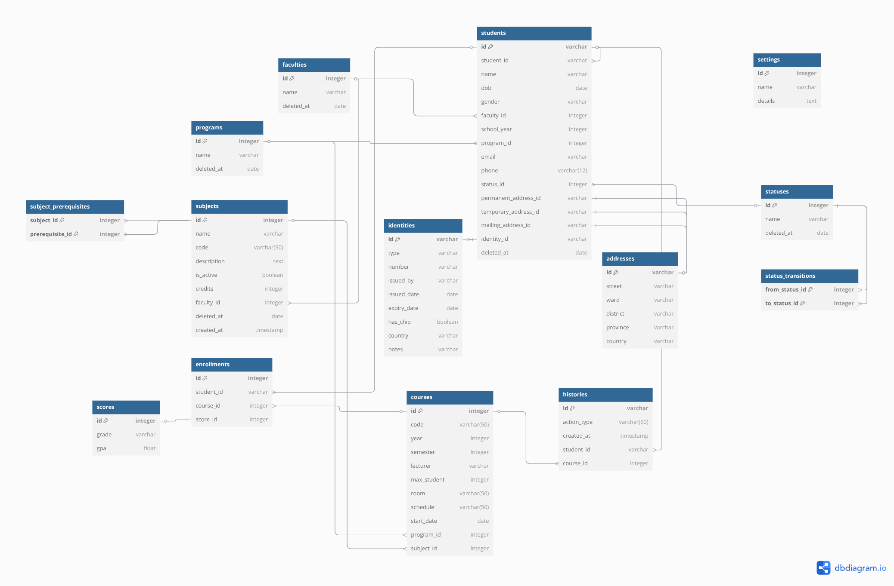
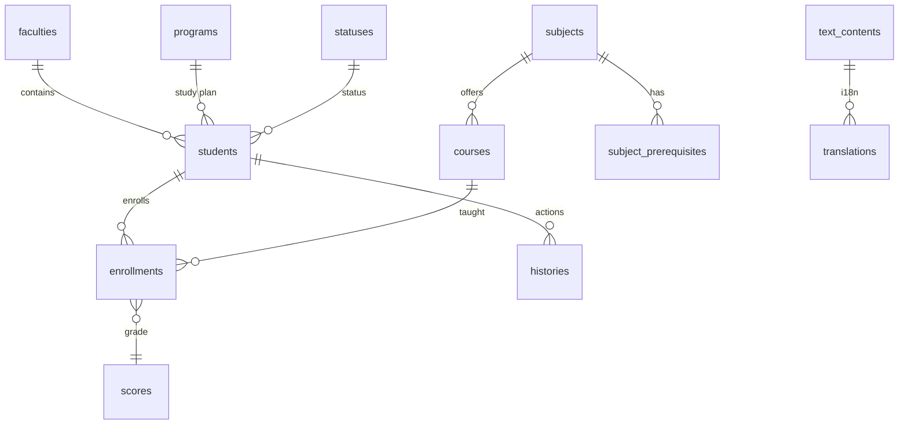

# Database Schema

## 1. Introduction

- This guide describes the database schema for the Student Management API. It covers the initial schema, migration strategy, table structures, relationships, constraints, naming conventions, and instructions for extending or modifying the schema.

- The entire database structure is defined in [database_creation.sql](../../database_creation.sql). This script creates all tables, constraints and seed data used by the application.

## 2. Migration Setup

- **Location:** [`database_creation.sql`](../../database_creation.sql) defines the baseline schema.
- **Tool:** Spring Boot integrates with Flyway out of the box to run migrations on startup.
- **Next Migrations:** Create files named `V<version>__<description>.sql` in the same folder. Flyway will apply them in numeric order.

## 3. Schema Overview

The core entities and supporting tables are:

| Table                   | Description                              |
| ----------------------- | ---------------------------------------- |
| `students`              | Central student profile                  |
| `faculties`             | Academic faculties                       |
| `addresses`             | Student address details                  |
| `courses`               | Course offerings per term                |
| `enrollments`           | Student-course enrollment records        |
| `histories`             | Audit trail of student actions           |
| `identities`            | Official identity documents              |
| `programs`              | Degree programs                          |
| `scores`                | Grade and GPA records                    |
| `settings`              | Application settings                     |
| `statuses`              | Student status types                     |
| `status_transitions`    | Allowed status changes                   |
| `subjects`              | Academic subjects                        |
| `subject_prerequisites` | Subject prerequisite mapping             |
| `text_contents`         | Localizable text containers              |
| `translations`          | Language-specific translations for texts |

## 4. Tables Definitions

### addresses

Stores permanent, temporary and mailing addresses.

- `id` – primary key
- `street` – street name
- `ward` – smaller administrative unit
- `district` – district name
- `province` – province or city
- `country` – country name

### identities

Passport or ID card information linked to a student.

- `id` – primary key
- `type` – document type such as "Passport" or "Chip Card"
- `number` – identifier printed on the card
- `issued_by` – authority issuing the card
- `issued_date` – date of issuance
- `expiry_date` – expiration date
- `has_chip` – whether the card contains a chip
- `country` – issuing country
- `notes` – optional remarks

### settings

Key/value pairs that drive application behaviour.

- `id` – generated primary key
- `name` – unique setting key
- `details` – textual details or JSON

### faculties

Represents a faculty or department.

- `id` – generated primary key
- `deleted_at` – soft delete timestamp
- `name_id` – reference to `text_contents`

### programs

Degree or training programs.

- `id` – generated primary key
- `deleted_at` – soft delete timestamp
- `name_id` – reference to `text_contents`

### statuses

Possible student states.

- `id` – generated primary key
- `deleted_at` – soft delete timestamp
- `name_id` – reference to `text_contents`

### students

Main student records linking to many other tables.

- `id` – primary key
- `student_id` – unique identifier shown to users
- `name` – full name
- `dob` – date of birth
- `gender` – gender string
- `faculty_id` – FK to `faculties`
- `school_year` – integer year index
- `program_id` – FK to `programs`
- `email` – unique email address
- `phone` – unique phone number
- `status_id` – FK to `statuses`
- `permanent_address_id` – FK to `addresses`
- `temporary_address_id` – FK to `addresses`
- `mailing_address_id` – FK to `addresses`
- `identity_id` – FK to `identities`
- `deleted_at` – soft delete timestamp

### status_transitions

Allowed changes between statuses.

- `from_status_id` – FK to `statuses`
- `to_status_id` – FK to `statuses`

### subjects

Courses of study grouped by faculty.

- `id` – generated primary key
- `code` – unique course code
- `is_active` – indicates availability
- `credits` – credit value
- `faculty_id` – FK to `faculties`
- `deleted_at` – soft delete timestamp
- `created_at` – timestamp of creation
- `name_id` – reference to `text_contents`
- `description_id` – reference to `text_contents`

### subject_prerequisites

Many-to-many table describing prerequisite subjects.

- `subject_id` – FK to `subjects`
- `prerequisite_id` – FK to `subjects`

### courses

Scheduled offerings of a subject within a specific program.

- `id` – generated primary key
- `code` – unique code per subject
- `year` – academic year
- `semester` – semester number
- `lecturer` – lecturer name
- `max_student` – enrollment cap
- `room` – physical room
- `schedule` – schedule string
- `start_date` – course start date
- `program_id` – FK to `programs`
- `subject_id` – FK to `subjects`

### enrollments

Join table between students and courses.

- `id` – generated primary key
- `student_id` – FK to `students`
- `course_id` – FK to `courses`
- `score_id` – FK to `scores`

### scores

Grades given for course enrollments.

- `id` – generated primary key
- `grade` – textual grade
- `gpa` – numeric GPA equivalent

### histories

Audit log of enrollment actions.

- `id` – primary key
- `action_type` – `ENROLLED` or `DELETED`
- `created_at` – timestamp of the action
- `student_id` – FK to `students`
- `course_id` – FK to `courses`

### text_contents

Abstract text container referenced by other tables.

- `id` – generated primary key
- `created_at` – when the text entry was created

### translations

Localized text belonging to a `text_content` record.

- `id` – generated primary key
- `text` – translated string
- `is_original` – indicates the canonical language
- `language_code` – e.g. `en` or `vi`
- `text_content_id` – FK to `text_contents`

Foreign key constraints ensure referential integrity between these tables. Unique constraints exist on fields such as `students.student_id`, `students.email` and `courses.code` to prevent duplicates.

## Entity Relationships

## Seed Data

`database_creation.sql` includes sample faculties, programs, students and subjects. These allow the system to start with realistic data for development or demos.

## Indexing and Performance

Several indexes are created automatically by PostgreSQL to enforce unique constraints. Additional indexes can be added for frequently searched columns:

- `students(student_id)` – speeds up lookups when importing data
- `courses(code)` – ensures the course schedule page loads quickly
- `translations(text_content_id, language_code)` – improves localized text retrieval

Use `EXPLAIN ANALYZE` during development to verify that queries are using the expected indexes. Avoid adding unnecessary indexes as they slow down writes.
